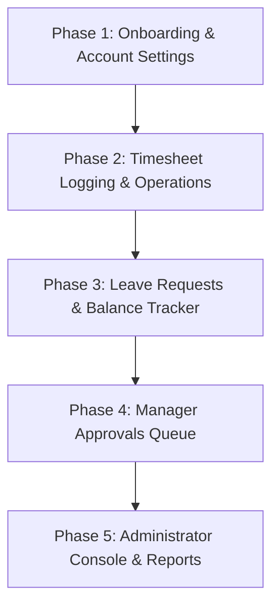

# TimesheetPro - User Documentation Plan

This document outlines a **5-Phase User Guide Documentation Plan** designed like the [Next.js Documentation](https://nextjs.org/docs). It focuses entirely on end-user onboarding, role permissions, daily operations, approval queues, and administrative settings.

---

## 🧭 Plan Structure at a Glance



---

## 🔐 Phase 1: Onboarding, Account Setup & Role Scopes
**Objective:** Explain how to access the application, register, complete safety verifications, and understand role permissions.

### User Guides to Create:
1.  **Account Registration & Email Verification:**
    *   **Signing Up:** Guide on filling the signup card (Name, Email, Password).
    *   **Email Verification:** Instructions on checking inbox, clicking the activation link, and accessing the "Resend Link" prompt if the token expires.
2.  **Signing In & Secure Reset:**
    *   How to sign in securely using password credentials.
    *   **Forgot Password:** Step-by-step instructions on requesting a reset link and configuring a new secure password.
3.  **Role Scope & Access Reference Table:**
    *   A matrix detail explaining what sections of the app each user role can access:
        *   **Employee:** Log timesheets, request leave, view personal dashboards/balances.
        *   **Manager:** Access approvals queue, approve/reject logs, inspect project tracking directories.
        *   **Admin:** Full access, including employee directory management, account toggles, and report exports.

---

## ⏱️ Phase 2: Timesheet Logging & Daily Entries (Employee Perspective)
**Objective:** Guide employees through recording daily hours, adjusting times, and managing timesheet logs.

### User Guides to Create:
1.  **Logging a Daily Shift:**
    *   Selecting the active project or job from the dropdown.
    *   Entering exact shift start (`Time On`) and end (`Time Off`) times.
    *   Choosing shift break duration (15m, 30m, 45m, 1h, 2h).
    *   Writing scope of work descriptions (e.g. details of wiring, tasks done).
2.  **Understanding Automatic Calculations:**
    *   Explain how the system calculates total work hours (Shift Duration minus Break Duration).
    *   Explain how overtime is automatically calculated (standard 8-hour daily limit threshold).
3.  **Managing Log History:**
    *   How to browse logged entries, search by project name, and filter by status (Pending, Approved, Rejected).
    *   **Editing & Deleting Logs:** Step-by-step instructions on correcting or deleting logged entries (restricted to `PENDING` entries only; locked once approved).

---

## 🏖️ Phase 3: Leave Requests & Balance Management (Employee Perspective)
**Objective:** Guide employees on checking their leave limits, requesting days off, and monitoring statuses.

### User Guides to Create:
1.  **Reading the Leave Balance Dashboard:**
    *   Explain how to read the visual metrics cards:
        *   **Annual Leave:** Visual progress bar of used days vs entitled days, and big remaining days display.
        *   **Sick Leave:** Logged and approved sick days.
        *   **Unpaid Leave:** Unlimited tracking indicator.
2.  **Requesting Leave:**
    *   Selecting Leave Type (Annual, Sick, Unpaid).
    *   Picking start and end dates (features an automatic requested workday counter indicator).
    *   Writing reason comments for manager review.
3.  **Cancelling Requests:**
    *   How to cancel a leave request while it is still pending.

---

## 📋 Phase 4: Manager Approvals Queue & Project Tracking (Manager/Admin Perspective)
**Objective:** Guide managers on auditing submissions, approving entries, and verifying client projects.

### User Guides to Create:
1.  **Navigating the Approvals Queue:**
    *   How to filter pending timesheets and leave requests.
    *   Explaining header metrics cards (total pending count, total requested days, distinct employees submitting).
2.  **Reviewing & Decision Making:**
    *   **Approvals:** Performing quick approvals from lists or detail views.
    *   **Rejections:** Step-by-step instructions on rejecting a request, which opens the feedback modal requiring comments.
3.  **Monitoring Active Projects:**
    *   Viewing projects, details, clients, and total aggregated staff hours logged per project.

---

## ⚙️ Phase 5: Administrator Console, Directory & Reports (Admin Perspective)
**Objective:** Guide system administrators through staff user directories, configurations, and exports.

### User Guides to Create:
1.  **Employee Directory Management:**
    *   Registering new personnel (which sets up default credentials and initializes annual leave balances).
    *   Modifying employee information (name, email, role).
    *   **Account Access Toggles:** Activating or deactivating employees (deactivation immediately blocks login).
2.  **Project Management:**
    *   Creating new client projects.
    *   Toggling projects active/inactive (inactive projects are hidden from timesheet dropdowns).
3.  **Exporting Reports:**
    *   Generating payroll and hour reports.
    *   Exporting tables to formats for audit logs and external payroll systems.

---

## 🤖 AI Prompts for Documentation Generation

You can copy and paste the following prompts into an AI assistant to generate the markdown documentation for each phase.

### Prompt 1: Phase 1 Guide - Getting Started & User Roles
```text
Act as an expert technical writer. Write a comprehensive, Next.js docs-style user guide for 'TimesheetPro: Getting Started, Account Setup & User Roles'.
The target audience is end-users (non-technical staff, managers, and administrators).

Please cover the following in detail:
1. Account Registration: Navigating the signup page, inputting name, email, and password.
2. Email Verification Gate: How the verification inbox process works, activating the account, and requesting a new link if the token expires.
3. Signing In: Entering credentials, handling invalid credential warnings, and logging in.
4. Forgot Password Flow: Requesting a reset link via email, entering a new password, and completing the update.
5. Role & Scope Permissions: Create a clean Markdown table comparing permissions for EMPLOYEE, MANAGER, and ADMIN accounts. Specify who can log hours, request leave, review timesheets, approve leave, create projects, edit employee records, and toggle user active states.

Formatting Guidelines:
- Use clean Markdown heading hierarchies (H2, H3).
- Use numbered lists for step-by-step instructions.
- Use GitHub-style alerts (e.g. > [!IMPORTANT] for email verification requirements, > [!WARNING] for account lockouts).
- Keep descriptions clear, professional, and visually structured.
```

### Prompt 2: Phase 2 Guide - Timesheet Logging & Daily Shift Entries
```text
Act as an expert technical writer. Write a comprehensive, Next.js docs-style user guide for 'TimesheetPro: Timesheet Logging & Daily Shift Entries'.
This guide is targeted at Employees recording their daily work.

Please cover the following in detail:
1. Log Daily Shift: Step-by-step instructions on navigating the creation form, selecting active projects, and selecting start/end dates.
2. Entering Time Parameters: Detail inputting 'Time On' (start shift) and 'Time Off' (end shift), and picking a break duration (15m, 30m, 45m, 1h, 2h).
3. Notes & Scope of Work: Guidelines on writing helpful shift logs and task summaries.
4. Automated Calculations: Explain how the system subtracts breaks to calculate total hours, and how daily overtime (hours exceeding 8.0h) is automatically computed.
5. Timesheet Management: How to browse logged timesheets, search by project name, filter by status, and edit or delete logs.
6. Submission Constraints: Explain that entries are only editable while in 'PENDING' status.

Formatting Guidelines:
- Use clear H2/H3 headings.
- Use step-by-step numbered guides.
- Use GitHub-style alerts (e.g. > [!IMPORTANT] to emphasize that approved timesheets cannot be modified or deleted).
- Structure lists cleanly.
```

### Prompt 3: Phase 3 Guide - Leave Requests & Balance Tracking
```text
Act as an expert technical writer. Write a comprehensive, Next.js docs-style user guide for 'TimesheetPro: Leave Requests & Balance Tracking'.
This guide is targeted at Employees managing their leave.

Please cover the following in detail:
1. Reading the Leave Dashboard: Explain the widgets for Annual Leave (visual progress bar of entitled vs used days, remaining days left), Sick Leave (used counter), and Unpaid Leave.
2. Submitting Leave Requests: Selecting Leave Type (Annual, Sick, Unpaid), choosing date ranges, noting the dynamic counter showing total requested workdays, and writing reason comments.
3. Balance Checks & Rules: Explain that annual leave requests will be blocked if requested days exceed remaining annual entitlements.
4. Cancelling Requests: How to cancel a pending leave request from the Leave History table.

Formatting Guidelines:
- Use clean Markdown heading hierarchies (H2, H3).
- Use numbered lists for submission instructions.
- Use GitHub-style alerts (e.g. > [!IMPORTANT] for leave balance limits, > [!WARNING] for non-retractable cancellations).
- Provide lists of leave types with their corresponding tracking behaviors.
```

### Prompt 4: Phase 4 Guide - Manager Approvals Queue & Projects
```text
Act as an expert technical writer. Write a comprehensive, Next.js docs-style user guide for 'TimesheetPro: Manager Approvals Queue & Project Tracking'.
This guide is targeted at Managers and Administrators.

Please cover the following in detail:
1. Navigating the Queue: How to filter and search pending timesheets and leave requests.
2. Queue Metrics: Explain the stats header cards (pending requests count, total pending days/hours, distinct requesting employees).
3. Reviewing Submissions: Step-by-step guides for quick-approvals and detail audits.
4. Rejections: Explain the rejection feedback workflow (mandatory comment detailing reasons for rejection).
5. Project Auditing: Accessing project summaries, verifying client descriptors, and auditing aggregate hours logged per job.

Formatting Guidelines:
- Use clear Markdown heading hierarchies.
- Use numbered instructions for performing approvals and rejections.
- Use GitHub-style alerts (e.g. > [!IMPORTANT] explaining that rejection comments are mandatory and will be shown to the employee).
```

### Prompt 5: Phase 5 Guide - Admin Console, Directory & Reports
```text
Act as an expert technical writer. Write a comprehensive, Next.js docs-style user guide for 'TimesheetPro: Admin Console, Directory & Reports'.
This guide is targeted at System Administrators.

Please cover the following in detail:
1. Employee Directory Management: How to register new employees (explaining default credentials and automatic leave balance creation), modify details, and toggle account active status.
2. Account Deactivation: Warn how toggling an account inactive immediately blocks login and stops timesheet inputs.
3. Project Administration: Creating new client projects, toggling active states, and editing descriptions.
4. Reports & Exports: Generating hours/payroll summaries, selecting periods, and exporting grids to CSV or PDF formats.

Formatting Guidelines:
- Use clear Markdown headings.
- Use step-by-step guides for user directory tasks.
- Use GitHub-style alerts (e.g. > [!CAUTION] for deactivating user accounts or deleting project mappings).
```

